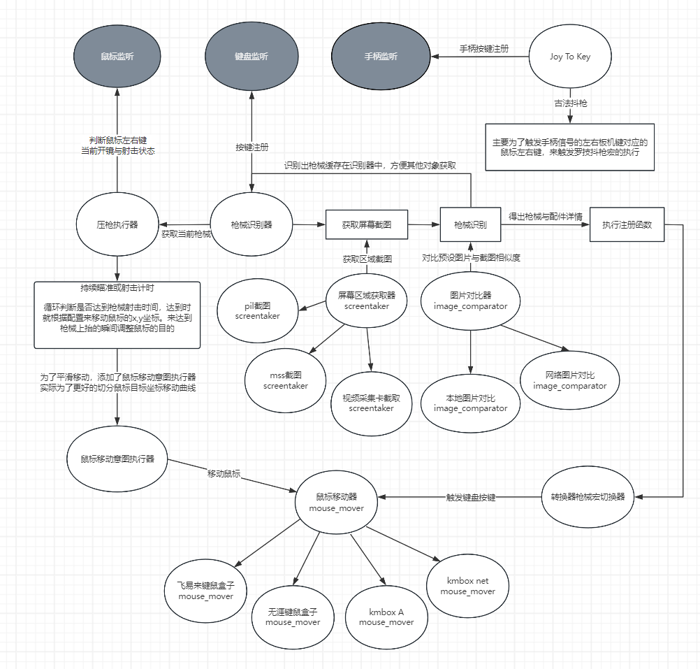
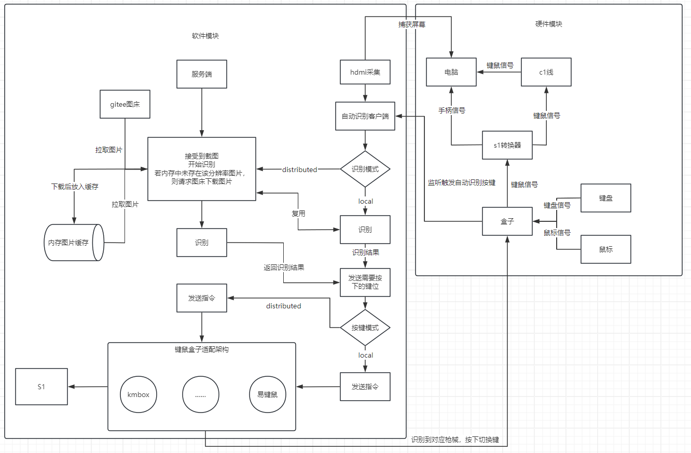

### Apex Recoils

apex自动识别枪械压枪宏

进度：

update(2024-03-01): 本项目已从键鼠反冲压枪重心转到对接s1自动识别（包含jtk触发罗技抖枪实现等），mnk数据开发将会无限期延后。

update(2024-04-10): 本项目重启mnk数据开发。

update(2024-04-18): mnk压枪数据开发基本完成。

开源交流群新建于2024-04-25，群号：206666041，入群前请贡献出你的star。

### 功能清单

- [x] 自动识别枪械
  - [x] 支持识别不同倍镜，涡轮增压器
  - [x] 适配截图方案：
    - [x] PIL
    - [x] Mss
    - [x] capture 视频采集卡
- [x] 鼠标平滑移动
- [x] 适配多种键鼠盒子
    - [x] km_box A
    - [x] km_box net
    - [x] 无涯键鼠
    - [x] 飞易来
- [x] 支持保存配置，多配置切换
- [x] 枪械数据开发中，现基于腰射灵敏1.6 ads全0.9倍率的基础上开发：
    - [x] CAR
    - [x] R99
    - [x] R301
    - [x] 平行步枪
    - [x] 电冲
    - [x] 转换者
    - [x] re45
    - [x] 暴走
    - [x] L星
    - [x] 哈沃克(涡轮)
    - [x] 专注(涡轮) 
    - [x] 喷火
    - [x] 哈沃克
    - [x] 专注
    - [x] 猎兽
    - [x] 汗洛
    - [X] 复仇女神
- [x] 支持抖枪，大小写开关
- [x] 自动识别支持ReaSnow s1转换器按键（需要串联km_box net，使用km_box_net的键鼠模式下生效）
    - 实现jtk
        - [x] axis转鼠标
    - [x] 自定义时长长按切换切换模式（弥补s1的长按无法自定义时长的短板）
    - [x] 自动识别的分布式（截图在client，识别与发送键盘指令在server）

### 使用说明

运行main.py

### 参与开发说明

#### 文件结构

```
.
├─config                      启动配置文件
│  ├─ref                        运行配置文件
│  ├─ReaSnowGun.json            转换器切换宏按键数据
│  └─specs.json                 压枪数据
├─core                          核心代码
│  ├─Config.py                读取配置类
│  ├─KeyAndMouseListner.py      鼠标和键盘监听
│  ├─RecoildsCore.py            压枪数据处理，并与鼠标意图移动交互
│  ├─SelectGun.py               枪械识别
│  ├─ReaSnowSelectGun.py        S1转换器切换宏
│  ├─KmBoxNetListener.py        kmbox net键鼠监听
│  └─ShakeGun.py                抖枪
├─images                      存放各分辨率枪械图色图片
│  ├─1920x1080
│  ├─………………
│  ├─2560x1440
│  ├─hop_up                     存放即用配件图片
│  └─scope                      存放瞄准镜图片
├─log                         打印日志的窗体定义
├─mouse_mover                 各类移动鼠标的实现
└─tools                       各类工具

```

#### 枪械数据开发

脚手架大概已开发完成，原理为：在开镜开枪时记时，当达到time_point时间（豪秒），会根据相同下标寻找x和y，将鼠标移动到相应位置达到压枪的效果。
由于apex特殊性，枪械在不同弹匣容量的情况下，其实是共享弹道的，所以只需要写出一条曲线即可。

对于有畜力的枪械，后续需要在mods中做其他模式的适配（待开发）

主要的工作量体现在调试开枪持续时间和鼠标移动的数据开发。 示例数据格式：
```json
[
  {
    "name": "R99",
    "type": "serial",
    "recoils": {
      "un_aim": {
        "time_points": [],
        "x": [],
        "y": []
      },
      "aim": {
        "time_points": [],
        "x": [],
        "y": []
      }
    }
  },
  {
    "name": "猎兽",
    "type": "intermittent",
    "recoils": {
      "aim": [
        {
          "index": 0,
          "time_points": [],
          "x": [],
          "y": []
        },
        {
          "index": 1,
          "time_points": [],
          "x": [],
          "y": []
        }
      ],
      "un_aim": []
    }
  },
  {
    "name": "哈沃克",
    "type": "serial",
    "recoils": {
      "un_aim": {
        "time_points": [],
        "x": [],
        "y": []
      },
      "aim": {
        "time_points": [],
        "x": [],
        "y": []
      },
      "turbocharger": {
        "un_aim": {
          "time_points": [],
          "x": [],
          "y": []
        },
        "aim": {
          "time_points": [],
          "x": [],
          "y": []
        }
      }
    }
  }
]
```
字段描述：
- name: 枪械名称，需要与识别图片名相同
- type: 枪械类型(全自动serial，连发枪intermittent)
- recoils: 压枪数据 
  - turbocharger（携带涡轮状态下的数据）
  - aim/un_aim: 瞄准状态时使用的数据 / 腰射状态时使用的数据，该数据针对枪械类型会有不同的形态 （全自动枪械时为单对象）：（连发枪时为数组，数组的单个对象为每点一下的压枪数据）
    - time_points: 执行时间点，以ms为单位 
    - x: 执行时间点x轴偏移 
    - y: 执行时间点y轴偏移

  
#### 源码开发

项目中主要构建在对键鼠与手柄的监听与函数注册，具体看图和源码。




#### 自动识别如何对接s1转换器

对接s1时的整体架构：



注意配置文件[ReaSnowGun.json](config%2FReaSnowGun.json)。

该json字典中，第一层key值为枪械名称，与枪械图片名称对应。识别到哪个就是使用哪个图片的名称来找value

第二层，是枪械对应倍镜为key，需要按下的触发键键值为value。

第三层（选填），若专注，哈沃克等枪，拥有hot-up配件。可填入turbocharger（涡轮增压器）对应触发的键值。

另外需要注意的是，该枪械未设定多个倍镜的宏时，并且拥有一个该枪械的任意倍镜通用宏，可增加一个键值为0的触发键。

[绑定按键参考km box net的头文件](HidTable.h)

以下为示例：

```json
{
  "p2020": {
    "0": "0x2D"
  },
  "R-301": {
    "1": "0x3A",
    "2": "0x3B",
    "3": "0x3C",
    "4": "0x3D"
  },
  "平行步枪": {
    "1": "0x3E",
    "2": "0x3F",
    "3": "0x40",
    "4": "0x41"
  },
  "哈沃克": {
    "1": "0x0C",
    "2": "0x12",
    "3": "0x13",
    "4": "0x2F",
    "turbocharger": {
      "1": "0x30",
      "2": "0x0D",
      "3": "0x31",
      "4": "0x0E"
    }
  },
  "专注": {
    "1": "0x61",
    "2": "0x54",
    "3": "0x55",
    "4": "0x56",
    "turbocharger": {
      "1": "0x63",
      "2": "0x57",
      "3": "0x56",
      "4": "0x63"
    }
  }
}

```

2K分辨率下图片已新增在项目中，需要新增其他分辨率的需要新增图片类别：

- `hop_up`：暂时只有涡轮增压[]
- `scope`下不同镜子图片：
    - 1xClassic.png
    - 1xHolo.png
    - 1xDigitalThreat.png
    - 1x-2xVariableHolo.png
    - 2xBruiser.png
    - 3xRanger.png
    - 4xVariableAOG.png

如何新增，首先在Config.py中，新增你需要分辨率对应的镜子和涡轮增压器的截图位置。

镜子的位置一共有三处，第1，2，3格，涡轮增压器的位置一共有两格，第4，5格。

```python
scope_screenshot_resolution = {
    (2560, 1440): [(2034, 1338, 2059, 1363), (2069, 1338, 2094, 1363), (2106, 1338, 2131, 1363)]
}
hop_up_screenshot_resolution = {
    (2560, 1440): [(2142, 1338, 2167, 1363), (2180, 1338, 2205, 1363)]
}

```

注意：每个位置之间截图出来的图片大小应该一致。并且文件夹中的图片大小不能与截图位置大小计算出的大小不一致，否则会出错。本代码中2K分辨率截图为25*
25。其他分辨率中图片大小可能有变动，仅供参考。


### 加入我们

欢迎加入我们，共同完善已有代码，优化已有数据或提供建议。我们将资源完全共享。因为加我的人员较多，暂只接收提供贡献的好友位，使用分享请加Q群。


